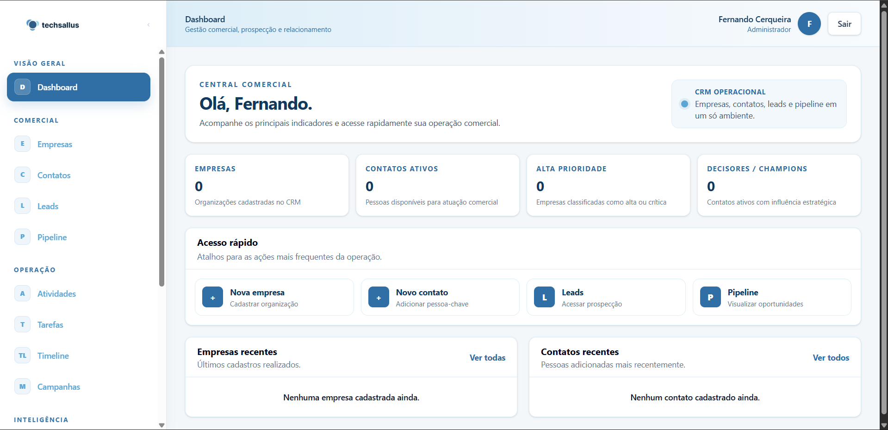
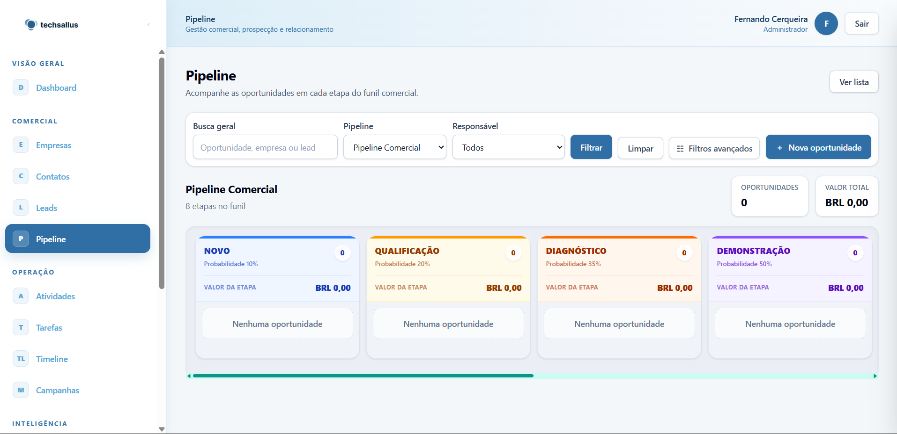
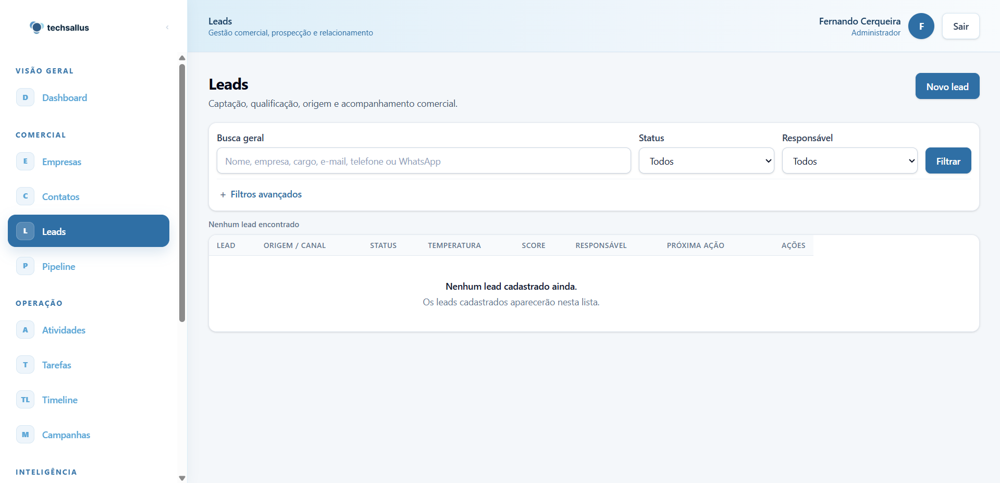
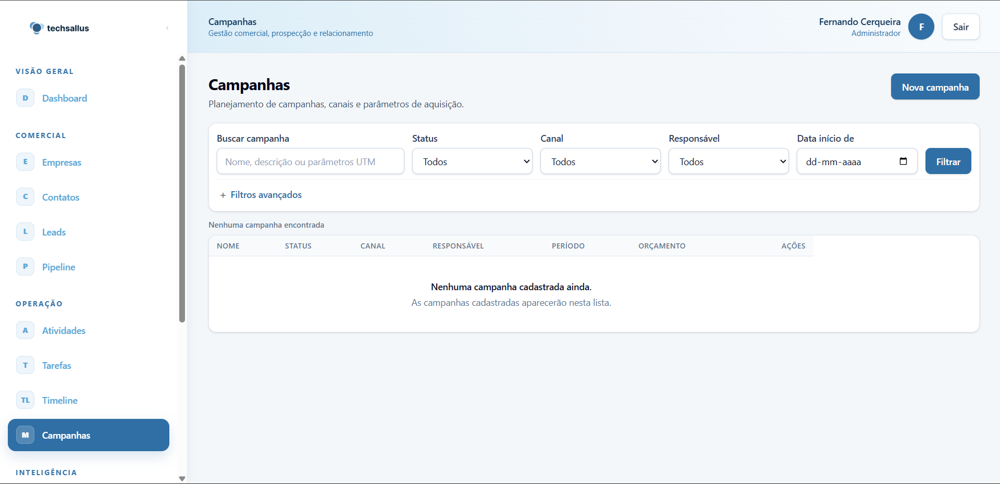
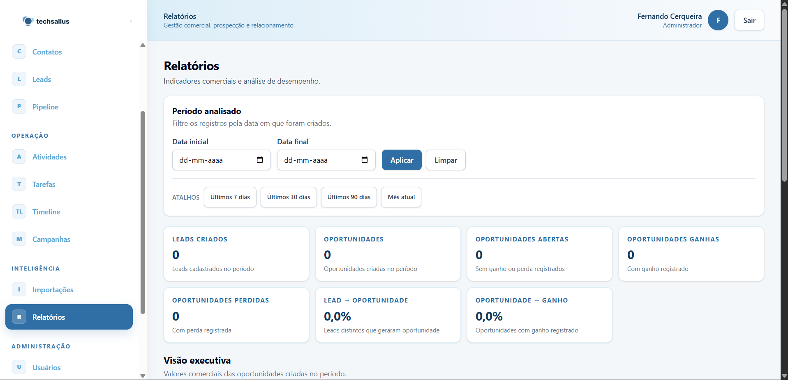
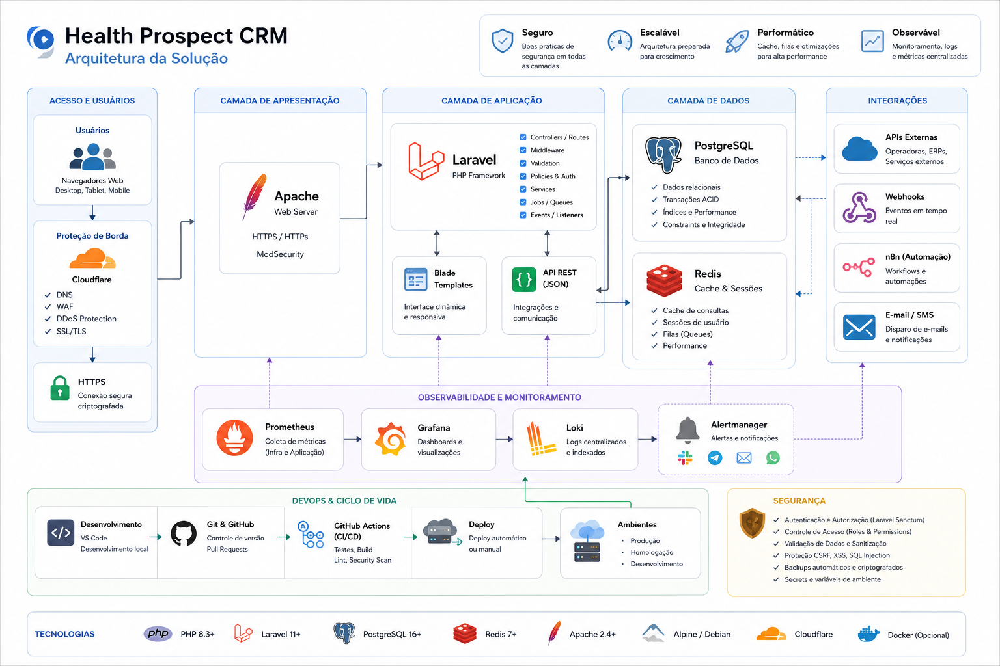

# Health Prospect CRM

> CRM B2B self-hosted para transformar prospecção comercial em um processo estruturado, rastreável e orientado por dados.


## Sobre o projeto

O **Health Prospect CRM** nasceu de uma necessidade prática: substituir planilhas e controles dispersos por uma aplicação própria para gestão da prospecção comercial B2B.

O foco inicial são empresas privadas do setor de saúde — clínicas, hospitais, laboratórios, centros médicos e diagnóstico — mas a arquitetura foi desenhada para não limitar o produto a esse segmento.

O projeto cobre a jornada comercial desde a organização de empresas e contatos até leads, qualificação, oportunidades, pipeline, atividades, importação de bases e indicadores.

## Interface da aplicação

### Dashboard
Visão central da operação comercial, com indicadores, acessos rápidos e acompanhamento de empresas e contatos.



### Pipeline comercial
Funil comercial em Kanban, com etapas, probabilidades, filtros, responsáveis e visão de valor das oportunidades.



### Gestão de leads
Tela de captação e acompanhamento de leads, com origem/canal, status, temperatura, score, responsável e próxima ação.



### Campanhas
Gestão de campanhas, canais, responsáveis, período, orçamento e parâmetros de aquisição.



### Relatórios
Indicadores comerciais e análise de desempenho, incluindo conversões de lead para oportunidade e de oportunidade para ganho.



## O problema que o projeto resolve

Processos comerciais baseados apenas em planilhas dificultam o acompanhamento histórico, a identificação de responsáveis, o controle das próximas ações e a análise do pipeline.

O CRM centraliza essas informações em uma estrutura relacional e auditável, permitindo acompanhar a evolução de cada relacionamento comercial e preparar a operação para automações e analytics.

## Principais capacidades

- gestão de empresas, contatos e leads;
- qualificação e conversão em oportunidades;
- pipeline comercial configurável em Kanban;
- histórico de movimentações e interações;
- atividades, tarefas e follow-ups;
- origens, canais, campanhas e atribuição de leads;
- importação estruturada de CSV/XLSX;
- pesquisa e filtros avançados;
- dashboard e relatórios comerciais;
- autenticação, RBAC, auditoria e hardening de segurança;
- API para integrações;
- base preparada para observabilidade e automação.

## Arquitetura da solução

A solução foi estruturada em camadas, separando acesso, aplicação, dados, integrações, observabilidade, segurança e ciclo de desenvolvimento.



A documentação técnica detalhada está disponível em [docs/architecture](docs/architecture/README.md).

### Stack principal

| Camada | Tecnologias |
|---|---|
| Sistema operacional | Debian Linux |
| Web server | Apache 2 + PHP-FPM |
| Backend | PHP 8.4+ / Laravel |
| Frontend | Blade, Tailwind CSS, Alpine.js / Livewire quando necessário |
| Banco de dados | PostgreSQL |
| Cache / filas | Redis / Laravel Queue |
| Observabilidade | Grafana, Prometheus, Loki, Alloy, Node Exporter |
| Automação | n8n Community opcional via API |
| Analytics | Matomo self-hosted opcional |
| Qualidade | PHPUnit, Laravel Pint, PHPStan/Larastan |
| CI/CD | GitHub Actions |

## Fluxo comercial

```text
Captação
   ↓
Lead
   ↓
Qualificação
   ↓
Oportunidade
   ↓
Pipeline
   ↓
Reunião
   ↓
Proposta
   ↓
Negociação
   ↓
Ganho / Perdido
```

Cada mudança relevante deve manter histórico para que o CRM não armazene apenas o estado atual do processo.

## Segurança

Segurança é uma prioridade arquitetural do projeto. O núcleo atual contempla controles como autorização no backend, RBAC, proteção contra IDOR, sessões e CSRF, rate limiting, headers de segurança, tratamento de proxies/HTTPS, auditoria, sanitização de logs e proteção do fluxo de importação.

A Sprint 10 consolidou o trabalho de **Security & Production Hardening**, incluindo testes de regressão e validação da superfície de segurança antes da evolução das próximas funcionalidades.

> Nenhuma credencial real deve ser armazenada no repositório. PostgreSQL e Redis não devem ser expostos publicamente.

- [Política pública de segurança](.github/SECURITY.md)
- [Documentação técnica de segurança](docs/architecture/SECURITY.md)

## Qualidade e testes

O projeto utiliza testes automatizados e validações de qualidade como parte do fluxo de desenvolvimento.

```bash
php artisan test
./vendor/bin/pint --test
./vendor/bin/phpstan analyse
pnpm run build
```

O ambiente de testes utiliza um banco PostgreSQL dedicado terminado em `_test`, evitando execução acidental contra o banco principal da aplicação.

## Estrutura da documentação

A documentação foi organizada para separar arquitetura, evolução histórica, desenvolvimento e materiais internos.

```text
docs/
├── architecture/   # arquitetura, banco, API e segurança
├── evolution/      # evolução técnica documentada por etapas
├── development/    # documentação para desenvolvimento
├── portfolio/      # visão pública e roadmap
└── internal/       # documentação operacional e instruções internas

assets/
├── screenshots/    # capturas da aplicação
├── diagrams/       # diagramas técnicos
└── branding/       # identidade visual
```

### Navegação

- [Documentação geral](docs/README.md)
- [Arquitetura](docs/architecture/README.md)
- [Evolução do projeto](docs/evolution/README.md)
- [Documentação de desenvolvimento](docs/development/README.md)
- [Visão de portfólio](docs/portfolio/README.md)
- [Roadmap](docs/portfolio/ROADMAP.md)
- [Como contribuir](CONTRIBUTING.md)

## Evolução do projeto

O desenvolvimento é incremental e mantém o histórico técnico no Git.

A documentação pública acompanha a construção em etapas:

1. [Visão e Arquitetura](docs/evolution/01-visao-e-arquitetura.md)
2. [Da Arquitetura à Construção](docs/evolution/02-da-arquitetura-a-construcao.md)
3. [Leads, Pipeline e Dados](docs/evolution/03-leads-pipeline-e-dados.md)
4. [Automações e Integrações](docs/evolution/04-automacoes-e-integracoes.md)
5. [Evolução do CRM](docs/evolution/05-evolucao-do-crm.md)

A prova de conceito original em **React + TypeScript + Vite + Supabase** foi preservada em `legacy/react-supabase`. A arquitetura oficial atual utiliza o núcleo Laravel self-hosted.

## Desenvolvimento local

### Requisitos

- PHP 8.4.1+
- Composer
- Node.js 22+
- pnpm
- PostgreSQL
- Redis

### Preparação

```bash
composer install
cp .env.example .env
php artisan key:generate
php artisan migrate
pnpm install
pnpm run build
```

Para executar os testes, configure um banco PostgreSQL dedicado, por exemplo:

```bash
createdb -O health_prospect_crm health_prospect_crm_test
php artisan test
```

## Objetivo técnico

Além de construir um CRM funcional, este repositório documenta decisões de arquitetura, modelagem de dados, segurança, troubleshooting, testes, CI e evolução incremental de uma aplicação real.

O projeto funciona também como demonstração prática de competências em **sistemas, infraestrutura, banco de dados, desenvolvimento backend, segurança e operações de TI**.

---

**Health Prospect CRM** — projeto em desenvolvimento contínuo.